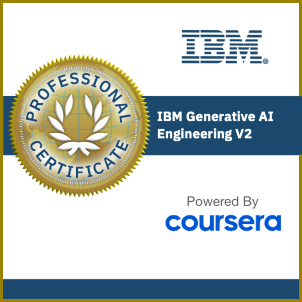

# IBM Generative AI Engineering Professional Certificate (Coursera)


<p align="center">
  <a href="IBM Generative AI Engineering Professional Certificate.pdf">
    
  </a>
</p>

<p align="center">
  <b>📜 Click the certificate image to view the full PDF.</b>
</p>

> Successfully completed all 16 courses and the capstone project.
> 🎉 **Successfully Completed**
>
> ✔ IBM Generative AI Engineering Professional Certificate
>
> ✔ 16 Courses
>
> ✔ Hands-on Labs
>
> ✔ Final Capstone Project

> A comprehensive repository documenting my complete learning journey through the **IBM Generative AI Engineering Professional Certificate** on Coursera, including notes, hands-on labs, assignments, experiments, mini-projects, and the final capstone project.

---

# 🚀 Overview

This repository serves as a structured record of my journey in learning **Generative AI Engineering**, covering everything from Machine Learning fundamentals to building production-ready Large Language Model (LLM) applications.

Rather than simply completing a certification, my objective throughout this program was to gain a deep understanding of how modern AI systems are designed, implemented, optimized, and deployed in real-world environments.

The repository contains course materials, implementation notebooks, experiments, and projects completed across the entire 16-course specialization.

---

# 🎯 Learning Objectives

The primary goals of this specialization were to:

- Build a strong foundation in Machine Learning and Deep Learning
- Understand Natural Language Processing (NLP) concepts
- Learn Transformer architectures (Attention, BERT, GPT)
- Develop applications powered by Large Language Models (LLMs)
- Explore Prompt Engineering techniques
- Fine-tune LLMs using modern PEFT techniques
- Build Retrieval-Augmented Generation (RAG) systems
- Gain hands-on experience with LangChain and Hugging Face
- Understand model evaluation and alignment techniques
- Develop production-ready AI applications

---

# 📚 Topics Covered

## Machine Learning

- Supervised Learning
- Unsupervised Learning
- Model Evaluation
- Feature Engineering
- Regression
- Classification

---

## Deep Learning

- Neural Networks
- Forward & Backpropagation
- Gradient Descent
- CNNs
- TensorFlow
- Keras
- PyTorch

---

## Natural Language Processing (NLP)

- Text Processing
- Tokenization
- Embeddings
- Word Representations
- Language Modeling
- Sequence Models

---

## Transformer Architecture

- Self Attention
- Multi-Head Attention
- Positional Encoding
- Encoder Architecture
- Decoder Architecture
- BERT
- GPT
- Text Generation

---

## Large Language Models (LLMs)

- Foundation Models
- Prompt Engineering
- Context Windows
- Temperature & Sampling
- Hallucination
- Model Selection

---

## Fine-Tuning LLMs

- Hugging Face Transformers
- Hugging Face Datasets
- Hugging Face Trainer
- PEFT
- LoRA
- QLoRA
- Prompt Tuning
- Prefix Tuning
- Instruction Tuning

---

## Alignment Techniques

- Reward Modeling
- Reinforcement Learning from Human Feedback (RLHF)
- PPO
- Direct Preference Optimization (DPO)

---

## Retrieval-Augmented Generation (RAG)

- LangChain
- RetrievalQA
- Document Loaders
- Text Splitters
- Embeddings
- Semantic Search
- Vector Databases
- FAISS
- ChromaDB

---

## AI Application Development

- Python
- Gradio
- End-to-End QA Systems
- PDF Question Answering
- LLM Integration
- API Development

---

# 🛠️ Technologies & Tools

### Programming Languages

- Python

### AI / Machine Learning

- PyTorch
- TensorFlow
- Keras
- Scikit-learn
- Hugging Face Transformers
- Hugging Face Datasets

### LLM Frameworks

- LangChain

### Vector Databases

- FAISS
- ChromaDB

### LLM Providers

- IBM watsonx
- Groq (Capstone Project)

### Data Processing

- Pandas
- NumPy

### Development Tools

- Jupyter Notebook
- VS Code
- Git
- GitHub

### User Interface

- Gradio

---

# 📂 Repository Structure

```text
Course 01/
Course 02/
Course 03/
...
Course 16/

Assignments/
Labs/
Projects/
Capstone Project/
Notes/
```

---

# 🚀 Capstone Project

The specialization concludes with an end-to-end **Retrieval-Augmented Generation (RAG) PDF Question Answering System**.

### Features

- Upload PDF documents
- Automatic document parsing
- Semantic chunking
- Embedding generation
- Vector database indexing
- Context retrieval
- LLM-powered question answering
- Interactive Gradio interface

### Technology Stack

- Python
- LangChain
- Hugging Face Embeddings
- FAISS / ChromaDB
- Groq (Llama 3.3)
- RetrievalQA
- Gradio

---

# 📈 Skills Developed

- Machine Learning
- Deep Learning
- Natural Language Processing (NLP)
- Transformer Architecture
- Large Language Models (LLMs)
- Prompt Engineering
- Hugging Face
- LangChain
- Retrieval-Augmented Generation (RAG)
- Vector Databases
- Semantic Search
- Fine-Tuning
- LoRA
- QLoRA
- PEFT
- RLHF
- PPO
- DPO
- AI Application Development
- Python Programming

---

# 🎓 Certification

**IBM Generative AI Engineering Professional Certificate**

Provider:

- IBM
- Coursera

Status:

**Completed ✅**

---

# 📌 Repository Purpose

This repository is intended to:

- Document my complete learning journey
- Serve as a long-term reference
- Showcase practical implementations
- Demonstrate hands-on Generative AI engineering skills
- Provide reusable notebooks and learning resources

---

# 🤝 Connect

If you're interested in Generative AI, LLM Engineering, Retrieval-Augmented Generation (RAG), or AI application development, feel free to connect or discuss ideas.

---

## ⭐ Support

If you found this repository useful or informative, consider giving it a **Star ⭐**.
